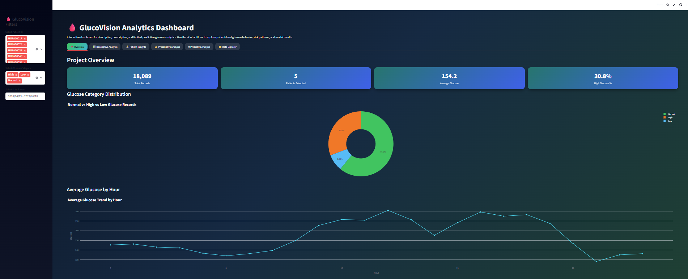
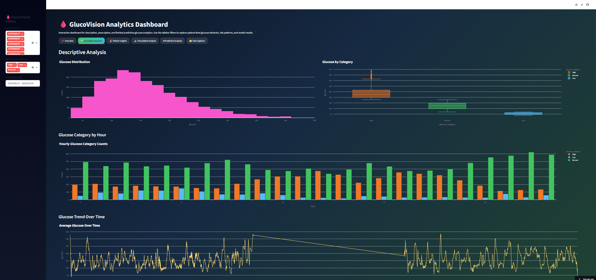
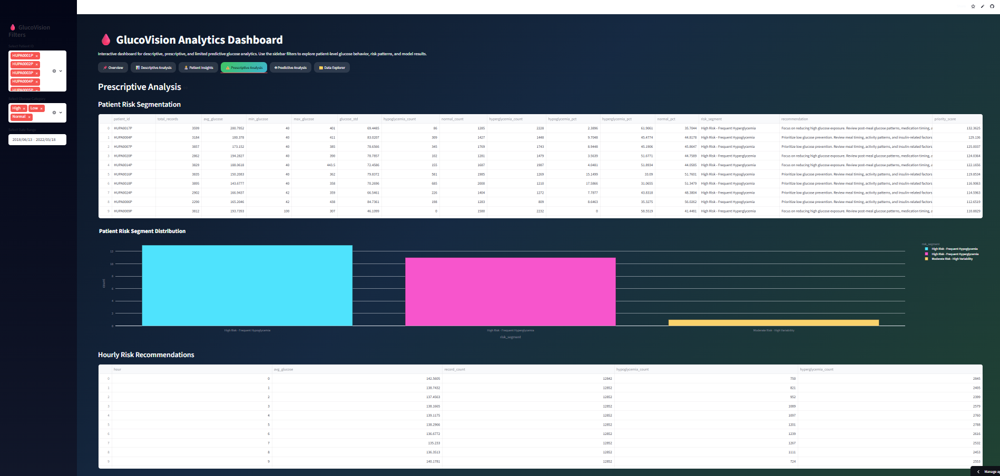
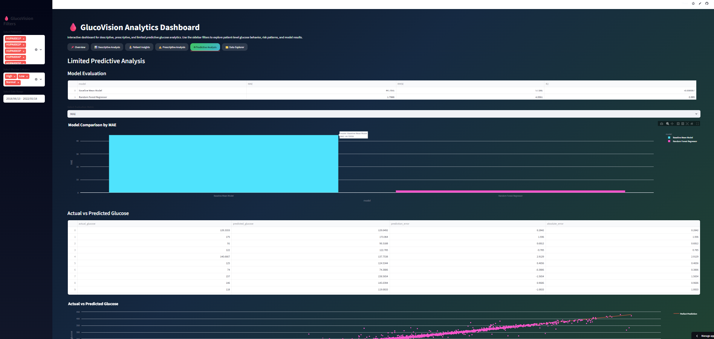

# GlucoVision Analytics

## 🩸 Diabetes Glucose Monitoring & Predictive Analytics Platform

An end-to-end healthcare analytics project built using Python, machine learning, and Streamlit to analyze glucose monitoring data from the HUPA-UCM Diabetes Dataset.

The project focuses on:

- descriptive analytics
- prescriptive analytics
- limited predictive analytics
- patient risk segmentation
- interactive dashboard development
- healthcare-focused data storytelling

---

# 📌 Project Overview

GlucoVision Analytics was developed to explore and analyze continuous glucose monitoring data from multiple patients.

The project simulates a real-world healthcare analytics workflow:

```text
Raw Patient CSV Files
        ↓
Data Cleaning & Preprocessing
        ↓
Feature Engineering
        ↓
Descriptive Analytics
        ↓
Prescriptive Analytics
        ↓
Predictive Modeling
        ↓
Interactive Streamlit Dashboard
```

The final solution provides interactive insights into glucose behavior, patient risk patterns, and predictive glucose estimation.

---

# 🎯 Business / Research Goal

The primary objective of this project is to:

- identify glucose behavior patterns
- detect high-risk glucose conditions
- analyze temporal glucose trends
- provide prescriptive healthcare recommendations
- build baseline predictive models for glucose estimation
- create a professional analytics dashboard for decision support

---

# 🧠 Key Features

## ✅ Data Engineering

- Combined multiple patient CSV files
- Datetime conversion and time-series validation
- Missing value analysis
- Duplicate handling
- Feature engineering
- Lag feature generation
- Rolling glucose statistics

---

## 📊 Descriptive Analytics

- Glucose distribution analysis
- Hourly glucose trends
- Patient-level glucose behavior
- Glucose category analysis
- Correlation analysis
- Statistical summaries

---

## ⚠️ Prescriptive Analytics

- Patient risk segmentation
- High-risk patient identification
- Hourly risk recommendations
- Risk-based monitoring insights
- Healthcare recommendation summaries

---

## 🤖 Predictive Analytics

Implemented baseline predictive modeling using:

- Baseline Model
- Random Forest Regressor

Prediction outputs include:

- MAE
- RMSE
- R² Score
- Actual vs Predicted comparison
- Feature importance analysis

---

## 🖥 Interactive Streamlit Dashboard

Dashboard includes:

- dark gradient UI
- vibrant interactive charts
- multiple dashboard tabs
- patient filters
- glucose category filters
- downloadable filtered datasets
- predictive model visualizations

---

# 🛠 Technologies Used

## Programming

- Python

## Libraries

- pandas
- numpy
- matplotlib
- seaborn
- scikit-learn
- plotly
- streamlit

## Tools

- VS Code
- Git
- GitHub
- Streamlit Community Cloud

---

# 📂 Project Structure

```text
GlucoVision Analytics/
│
├── data/
│   └── processed/
│       ├── glucovision_cleaned_preprocessed.csv
│       └── patient_summary.csv
│
├── outputs/
│   ├── descriptive analysis output CSVs
│   ├── patient_risk_segmentation.csv
│   ├── hourly_risk_recommendations.csv
│   ├── predictive_model_evaluation.csv
│   ├── actual_vs_predicted_glucose.csv
│   └── predictive_feature_importance.csv
│
├── notebooks/
│   ├── 01_project_setup.ipynb
│   ├── 02_data_understanding.ipynb
│   ├── 03_data_cleaning_preprocessing.ipynb
│   ├── 04_descriptive_analysis.ipynb
│   ├── 05_prescriptive_analysis.ipynb
│   └── 06_limited_predictive_analysis.ipynb
│
├── dashboard/
│   └── app.py
│
├── requirements.txt
├── README.md
└── .gitignore
```

---

# 📈 Dataset Information

Dataset used:

**HUPA-UCM Diabetes Dataset**

Dataset characteristics:

- multivariate healthcare dataset
- time-series glucose monitoring data
- multiple patient recordings
- 5-minute interval observations

Features include:

- glucose
- calories
- heart_rate
- steps
- basal_rate
- bolus_volume_delivered
- carb_input

---

# 🔍 Feature Engineering

Created engineered features such as:

## Time Features

- hour
- day
- day_of_week
- date

## Lag Features

- glucose_lag_1
- glucose_lag_3
- glucose_lag_6

## Rolling Features

- glucose_rolling_30min
- glucose_rolling_1hr

These features improve temporal understanding and predictive modeling.

---

# 📊 Dashboard Preview

## Main Dashboard Sections

### 📌 Overview

- KPI cards
- glucose summaries
- category distributions

### 📊 Descriptive Analysis

- histograms
- boxplots
- hourly trends
- temporal analysis

### 🧑‍⚕️ Patient Insights

- patient-level analysis
- glucose timelines
- patient summaries

### ⚠️ Prescriptive Analysis

- risk segmentation
- recommendation analytics

### 🤖 Predictive Analysis

- model comparison
- actual vs predicted glucose
- feature importance

### 📁 Data Explorer

- raw data browsing
- downloadable filtered datasets

## Dashboard Preview






---

# 🚀 Live Dashboard

https://your-streamlit-app-link.streamlit.app

---

# ▶️ How to Run Locally

## 1. Clone Repository

```bash
git clone https://github.com/your-username/glucovision-analytics.git
```

## 2. Navigate to Project Folder

```bash
cd glucovision-analytics
```

## 3. Create Virtual Environment

```bash
python -m venv venv
```

## 4. Activate Virtual Environment

### Windows

```bash
venv\Scripts\activate
```

### Mac/Linux

```bash
source venv/bin/activate
```

## 5. Install Dependencies

```bash
pip install -r requirements.txt
```

## 6. Run Streamlit Dashboard

```bash
streamlit run dashboard/app.py
```

---

# 📌 Key Insights

Some important findings from the analysis:

- Certain patients experience frequent high glucose episodes
- Glucose levels vary significantly by hour of day
- Rolling glucose statistics improve predictive capability
- Random Forest outperformed baseline prediction approaches
- Risk segmentation can help prioritize patient monitoring

---

# 🔮 Future Improvements

Potential future enhancements:

- advanced time-series forecasting
- real-time glucose streaming
- SHAP explainability
- deep learning models
- anomaly detection
- cloud database integration
- multi-page Streamlit dashboard
- PDF report generation

---

# 👨‍💻 Author

## Humera Anjum

Python • Data Analytics • Machine Learning • Healthcare Analytics

GitHub:

https://github.com/HumsShaik

LinkedIn:

https://www.linkedin.com/in/humera-anjum-98273a209/

---

# ⭐ Acknowledgements

- HUPA-UCM Diabetes Dataset
- Streamlit
- scikit-learn
- Plotly
- Open-source Python ecosystem


